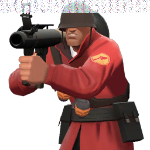

# Steganosaur!

This is a simple little steganography tool that takes in a string and hides it inside of a PNG.  
## Usage:    
steganosaur [filename] [string] (optional: outbound filename)  
Store a string inside [filename].  The image is copied, and the default output name is 'out.png'.
steganosaur [filename] 
Read [filename] and interpret it as if it had a string hidden inside. If there's nothing in there, you'll get a bunch of junk.  

The program stores/hides data by changing the least significant bits (LSBs) of each RGB color channel in each pixel to a bit from the string.
(Note that this tool only works with ASCII strings; it assumes that the string elements are char's and that they each have 8 bits.)  

  
